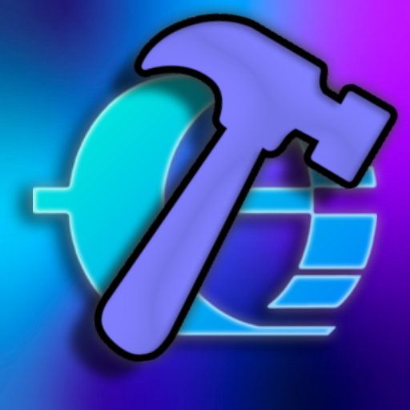

#  API Dashboard

## Summary
C++ and ImGui based dashboard app surrounding Orion Drift's API.

## Getting Started
1. Clone the repository
   ```powershell
   git clone https://github.com/oriondriftapi/dashboard.git
   ```
2. Open the .sln file inside of Visual Studio 2022 (or Visual Studio 2026)
3. After opening the project in Visual Studio, navigate to the 'build' tab on the toolbar and then build the solution
4. Go to the build directory (depends on if you build in DEBUG or RELEASE) and open the .exe generated

## Dependencies
- [imgui](https://github.com/ocornut/imgui)
- [json](https://github.com/nlohmann/json)
- [curl](https://github.com/curl/curl)

## How it works
The client side of the Dashboard (the application you open) talks to our javascript backend (i know this isnt very ideal lol), this is what all the stations, fleets, and players are retrieved from.

## Support
If you have any trouble compiling, downloading, or just general issues with the repo.
Please make an issue in the issues tab, or contact us on discord!

To contact us on discord please DM us at @oriondriftapi, or join our [discord server](https://discord.gg/v383ngramQ)
